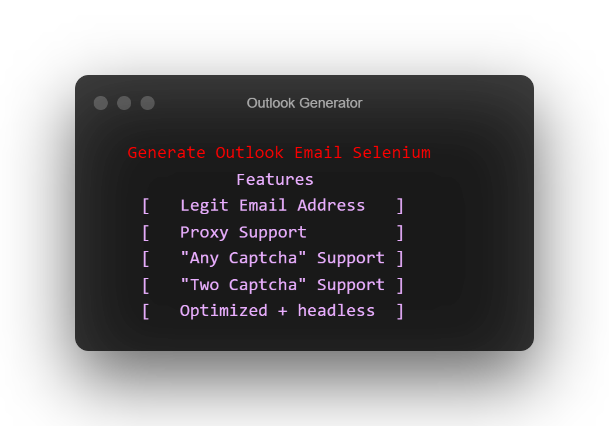

<p align="center"></p>
<div align="center" style="margin-top: 0;">
   <h1>Outlook Generator</h1>
   <p>Dont Skid 👀</p>
</div>
<em><h5 align="center">(Programming Language - Python 3)</h5></em>
<p align="center">
<a href="#"></a>
<a href="#"></a>
<a href="#"></a>
<a href="https://github.com/MatrixTM/OutlookGen/issues"></a>
<p align="center"></p>

---

<p align="center"></p>

## 📝 Document

### Use Http proxies
### Before Run [Check Here](#config_doc)


**Install Requirements**

```
pip3 install -r requirements.txt
```

**Install Chrome Driver**

##### Windows

[//]: # (###### Alos You Can Watch [This Video]&#40;https://youtube.com&#41;)

- Go [Here](https://chromedriver.chromium.org/downloads) And Download chromedriver Windows Version
- Put chromedriver.exe into Script folder

##### Linux

*Run This Command*

```shell script
sudo apt install chromium-chromedriver
```

- Go [Here](https://chromedriver.chromium.org/downloads) And Download chromedriver Linux Version
- Put chromedriver into Script folder

##### Fresh Google Colab

*Run This Commands*

### Install

```shell
!apt update && apt install chromium-chromedriver && git clone https://github.com/MatrixTM/OutlookGen.git eGen && cd eGen/ && pip3 install -r requirements.txt
```

### Run

```shell
!cd eGen/ && python3 main.py
```

---
<div id="config_doc">

## ⚙️ Config Document

| Name              | Description                                                      |
|-------------------|------------------------------------------------------------------|
| Prefix            | Log Prefix (Default: &beGen&5>> )                                |
| ProxyFile         | proxy file path (Default: proxy.txt)                             |
| OutputFile        | output file path (Default: account.txt)                          |
| Timer             | Generate Timer (Default: true)                                   |
| ProxyCheckTimeout | Checking Proxy Timeout (Default: 2)                              |
| providers         | Captcha Providers (Default: anycaptcha/twocaptcha)               |
| api_key           | Your Api Key (Default: )                                         |
| site_key          | outlook site key (Default: B7D8911C-5CC8-A9A3-35B0-554ACEE604DA) |
| Domain            | Email Domain (Default: @hotmail.com/@outlook.com)                |
| minBirthDate      | Minimum BirthDate (Default: 1980)                                |
| maxBirthDate      | Maximum BirthDate (Default: 1999)                                |
| PasswordLength    | Password Length (Default: 10)                                    |
| FirstNameLength   | First Name Length (Default: 5)                                   |
| LastNameLength    | Last Name Length (Default: 5)                                    |
| DriverArguments   | driver argument list (Default: ...)                              |

</div>

#### Change this configs

- providers
- api_key
- Domain

**`config.json` Example**

```json
{
  "Common": {
    "Prefix": "&beGen&5>> ",
    "ProxyFile": "proxy.txt",
    "OutputFile": "account.txt",
    "Timer": true,
    "ProxyCheckTimeout": 2
  },
  "Captcha": {
    "providers": "anycaptcha",
    "api_key": "0dv3a5b276b347bxxxx12a6x8a9m862",
    "site_key": "B7D8911C-5CC8-A9A3-35B0-554ACEE604DA"
  },
  "EmailInfo": {
    "Domain": "@outlook.com",
    "minBirthDate": 1980,
    "maxBirthDate": 1999,
    "PasswordLength": 10,
    "FirstNameLength": 5,
    "LastNameLength": 5
  },
  "DriverArguments": [
    "--disable-logging",
    "--disable-login-animations",
    "--disable-notifications",
    "--incognito",
    "--ignore-certificate-errors",
    "--disable-blink-features=AutomationControlled",
    "--disable-gpu",
    "--headless",
    "--no-sandbox"
  ]
}
```

## Need a Cheap Server? No Problem

<a href="https://aeza.net/?ref=375036"></a>

#### You can buy an 10Gbps/Cheap server from [Aeza Hosting](https://aeza.net/?ref=375036) with crypto (100% anonymous).
